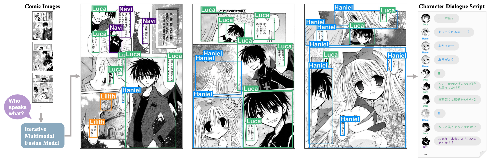

# Zero-Shot Character Identification and Speaker Prediction in Comics via Iterative Multimodal Fusion (ACMMM2024 Oral)
This repository includes all codes to reproduce the main experiments of our paper: [Zero-Shot Character Identification and Speaker Prediction in Comics via Iterative Multimodal Fusion](https://arxiv.org/abs/2404.13993)



### Overview
In this study, we pioneer the integration of character identification and speaker prediction tasks in comics. 
Traditional supervised learning methods typically require specific annotations for each comic title; however, our zero-shot approach utilizes only comic images.
Leveraging the high-level text understanding capabilities of large language models (LLMs) and integrating multimodal information, we have developed an iterative multimodal fusion method. 
This approach requires no training data or annotations and can be directly applied to any comic series, making it highly suitable for practical applications.

Our contributions are summarized as follows:
- **New tasks**: We are the first to integrate the tasks of character identification and speaker prediction in comics. Furthermore, our approach tackles zero-shot tasks without requiring any training or annotations, which are directly applicable to real-world scenarios.
- **Iterative multimodal fusion**: We pioneer in revealing the potential of LLMs for comics analysis and propose a novel iterative framework that integrates text and image modalities. This is the first study to use both text and image information for character identification and speaker prediction, which are unexplored even outside zero-shot settings.

This README mainly consists of two parts:
- Codes: Briefly explain each file (e.g., which file corresponds to which module).
- How to run: Describe how to reproduce the experiments.

# Codes
- `speaker_prediction/`
  - `speaker_prediction.py`
    - Main module of our approach.
    - You can get the correspondence between pseudo codes in the paper (Algorithm 1) and actual codes by reading the function `ZeroShotSpeakerCharacterPredictor.predict_speaker_and_classify_characters()`.
  - `llm_speaker_annotation.py`
    - Speaker prediction module. 
  - `prompts/`
    - LLM prompts used in our experiments. (English translated version is in our supplementary material.)
  - `character_classification.py`
    - Character identification module.
  - `image_classification/`
    - The codes related to training and testing image classifiers.
- `eval.py`
  - Codes related to running experiments including pre-processing of Manga109 dataset, executing the modules, and saving the experimental results.
- `aggregate_eval.py`
  - Analyze experimental results obtained from eval.py to compute final metrics.     

# How to run

## Prerequisites

- **Manga109 dataset**
    - Download from http://www.manga109.org/en/download.html
    - Put at `data/Manga109_released_2023_12_07`
- **Manga109Dialog annotation**
    
    ```
    cd data/
    git clone https://github.com/manga109/public-annotations
    ```
- **Pre-trained models for character classification** 
    ```
    mkdir data/models/
    wget https://ldcwnxk0f27z0wgkkof02ejpxpyglx73.s3.ap-northeast-1.amazonaws.com/models/data70_resnet_square_model.pt -P data/models/
    ```
    

## Environment setup

- Setup python environment
    
    ```
    # Create and activate a Conda environment
    conda create -n speaker-prediction python=3.8
    conda activate speaker-prediction
    # Install required packages
    pip install -r requirements.txt
    ```
    
- Set Open AI API key
    ```
    # Set your OpenAI API key (replace 'sk-xxxxxx' with your actual key)
    export OPENAI_API_KEY=sk-xxxxxx
    ```
    - You can get API key from https://openai.com/blog/openai-api.
    - Ensure you use an account where GPT-4 is available.
    - Note that API cost will be charged to your account by running codes.

## Test

Execute `eval.py` for speaker prediction and character identification using the Manga109 dataset.

- Single book
    
    ```
    python eval.py -d data/Manga109_released_2023_12_07 -n 2 -b YamatoNoHane --exp_name test_single_book # Specify book title as argument '-b'
    ```
    
- Text only (all books of test set)
    
    ```
    python eval.py -d data/Manga109_released_2023_12_07 -n 1 --exp_name test_text_only # Add argument '-n 1'
    ```
    
- Up to 3rd iteration (all books of test set)
    
    ```
    python eval.py -d data/Manga109_released_2023_12_07 -n 4 --exp_name test_multimodal # Add argument '-n 4'
    ```
    

## Analysis of results

Analyze your experiment's results using `aggregate_eval.py`.

```
# Specify experiment names and iteration steps that you want to analyze
python aggregate_eval.py --exp_names test_multimodal --steps 0 1 2 3

# Single book
python aggregate_eval.py --exp_names test_single_book --steps 0 1 -b YamatoNoHane

```

Metrics for evaluation include:
- **Speaker Prediction**
  - `T_micro`: Micro-average accuracy (main metric)
  - `T_macro`: Macro-average accuracy
  - `T_macro_top5`: Macro-average accuracy for the top 5 characters
  
- **Character Identification**
  - `C_micro`: Micro-average accuracy (main metric)
  - `C_macro`: Macro-average accuracy
  - `C_macro_top5`: Macro-average accuracy for the top 5 characters

# Citation
If you find this research helpful, please consider citing our paper:
```
@inproceedings{li2024zeroshot,
  title={Zero-shot character identification and speaker prediction in comics via iterative multimodal fusion},
  author={Li, Yingxuan and Hinami, Ryota and Aizawa, Kiyoharu and Matsui, Yusuke},
  booktitle={Proceedings of the ACM International Conference on Multimedia},
  year={2024}
}
```
Please cite the following paper if you use the Manga109Dialog dataset or our scene graph generation models for comics speaker prediction:
```
@inproceedings{li2024manga109dialog,
  title={Manga109Dialog: A Large-scale Dialogue Dataset for Comics Speaker Detection},
  author={Li, Yingxuan and Aizawa, Kiyoharu and Matsui, Yusuke},
  booktitle={Proceedings of the IEEE International Conference on Multimedia and Expo},
  year={2024}
}
```
